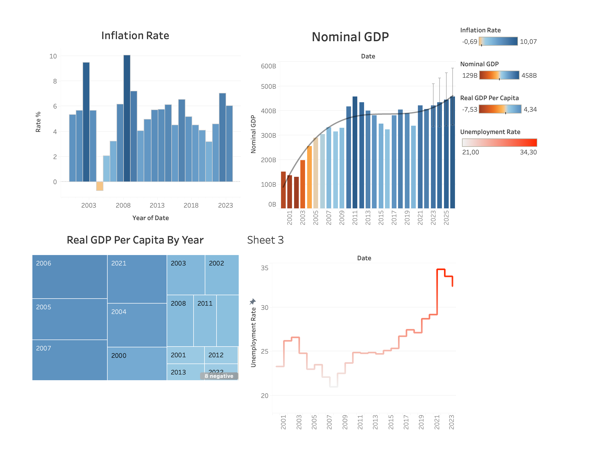
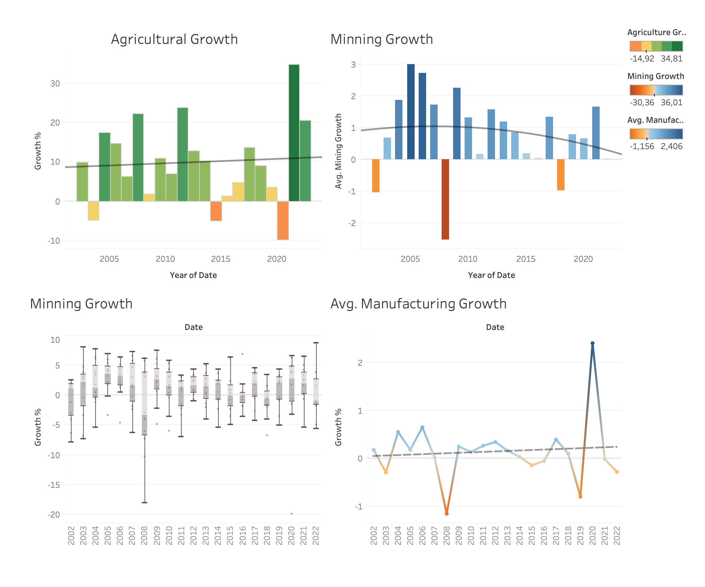

## SA Economic Data: ETL Pipeline

A learning project to design an ETL pipeline processing South African economic data using the FRED API. Key metrics include GDP, interest rates, and sector growth. Interactive Tableau dashboards visualize insights. Built with Python, Pandas, and Tableau.

The following are dashboards that show South Africa's economic indicators and their trends.    
These indicators include makor South African sectors such as agriculture, mining, and manufacturing.
Inflation, GDP, and unemployment rates are also visualised.

Key visuals include bar charts, line charts, box plots, and treemaps, providing insights into sector performance, economic variability, and long-term trends.

  
  

