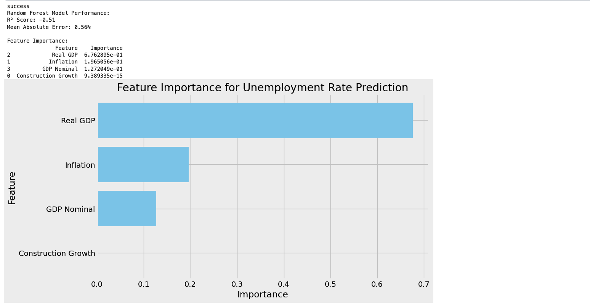
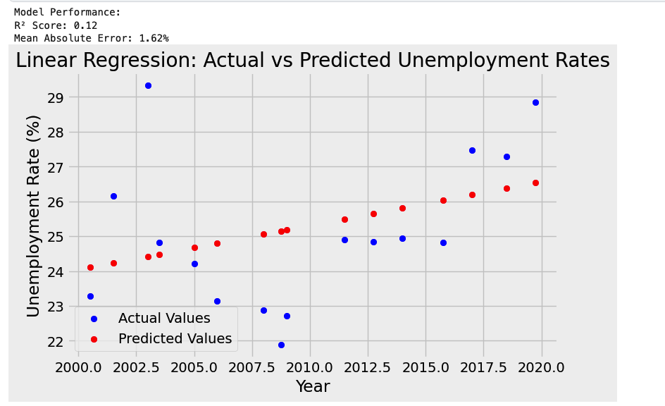
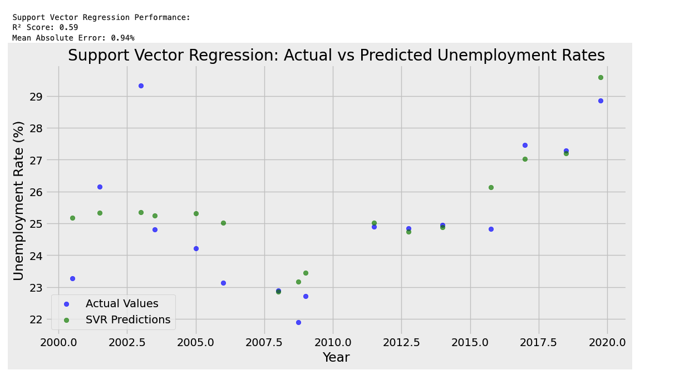
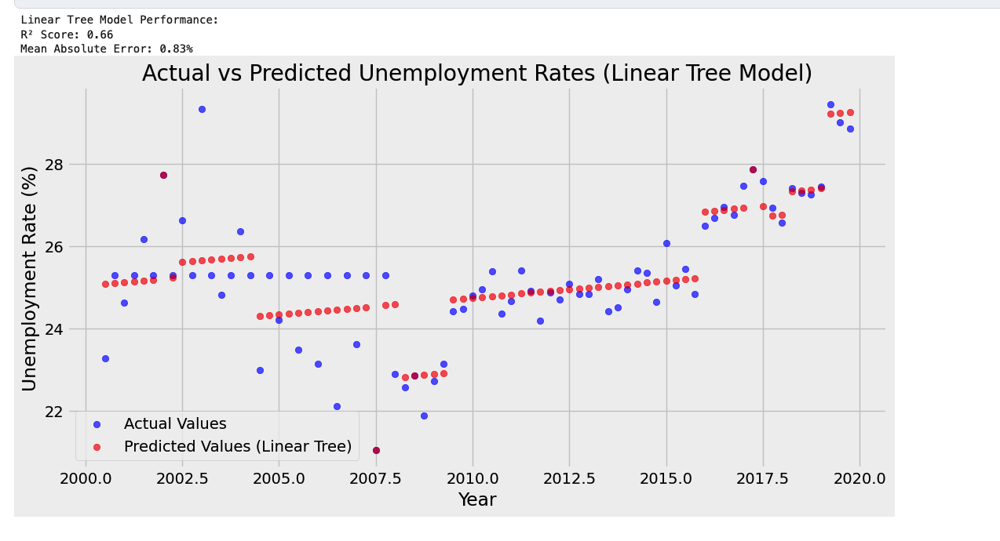

# Economic-Data-Analysis-

A Data Science project leveraging pandas and the FRED API to clean, visualise and analyse economic indicators.

### Description

This project focuses on analyzing South Africa's unemployment rate from 2000 to early 2020, incorporating various economic indicators to identify potential relationships and influencing factors.

Several ML models are used to determine which economic indicatora influence unemployment rate in South Africa.

The project aims to provide insights into South Africa's unemployment trend.

  
  
  
  

